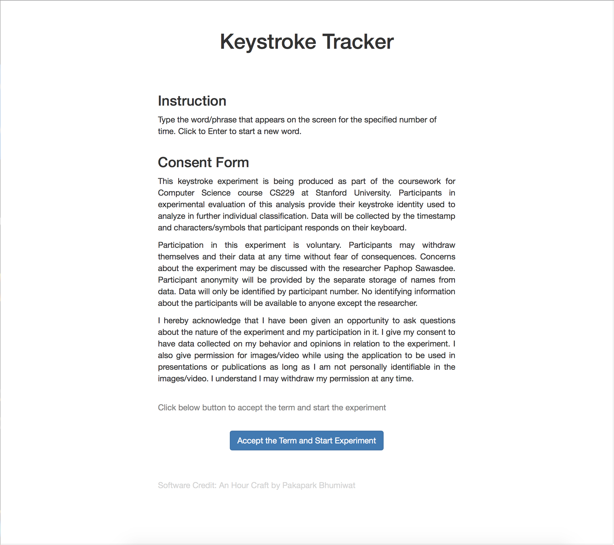
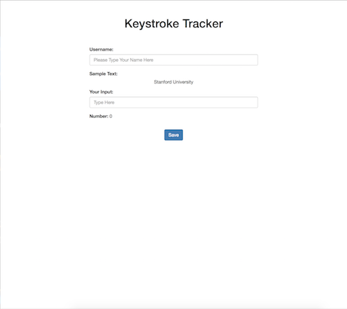

# Keystroke Tracker Template

This template is designed to gather the keystroke data for each participant in offline manner. This keystroke data can be used to train the program to identify the keystroke's owner using simple machine algorithm (like XGBoost Tree). The original purpose of this template is to help Stock Sawasdee gathering keystroke data for CS229 Machine Learning class at Stanford University.

### Files

##### index.html

This file contains the basic content form since keystroke is a highly sensitive data for each participant. After clicking consent, this file will redirect to another page 'type.html' to gather the data.

##### type.html

This file asks the participant to fill in the username and type the word shown in the sample text as fast as you can. The data will be saved for further analysis

### Images

### Implementation Time

1 hour
